# Fundify 
Fundify es una plataforma de crowdfunding que permite a los usuarios invertir en fundaciones y obtener beneficios a cambio. La plataforma conecta a fundaciones con gente que este dispuesta a apoyar, facilitando el financiamiento de las mismas y su sustento.

## Página principal
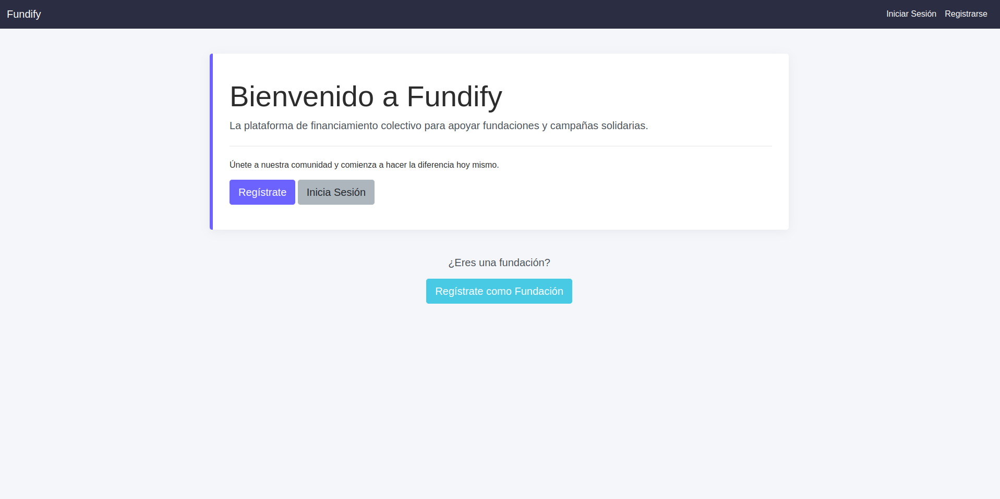

## Login de la página
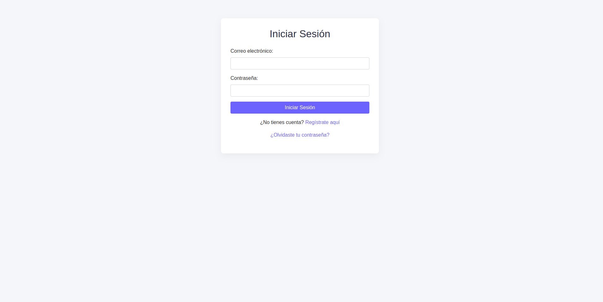

## Dashboard de usuario
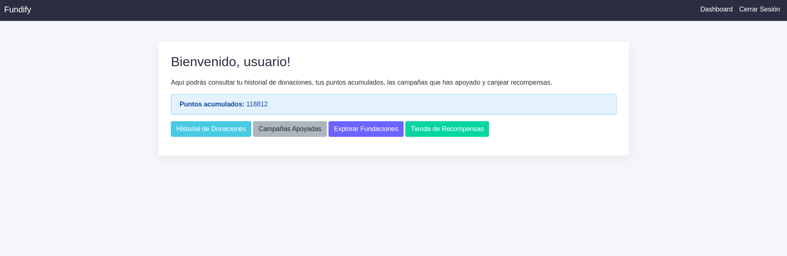

## Historial de donaciones
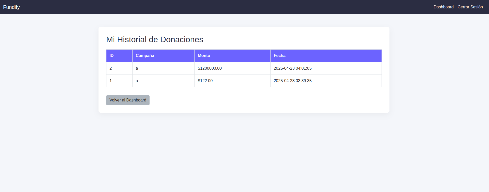

## Historial de campañas apoyadas
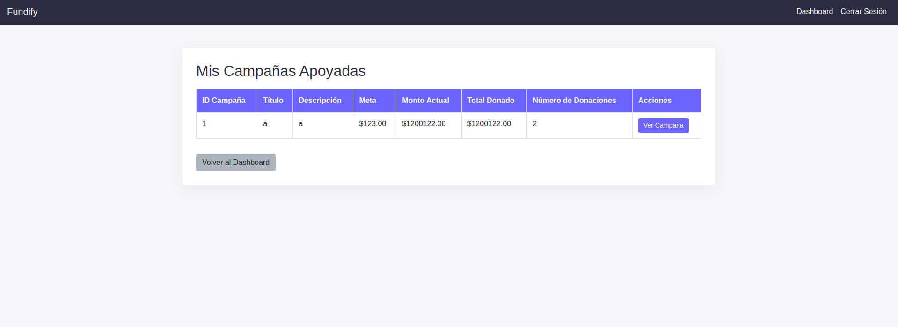

## Ver campaña
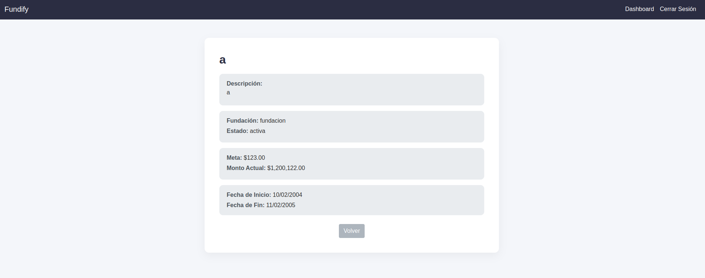

## Explorar fundaciones
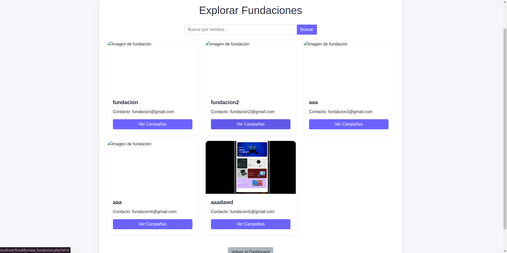

## Donar a campaña
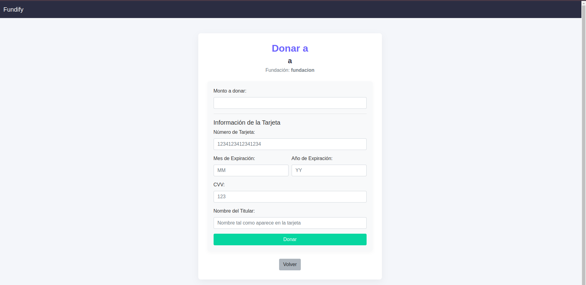

## Tienda de recompensas
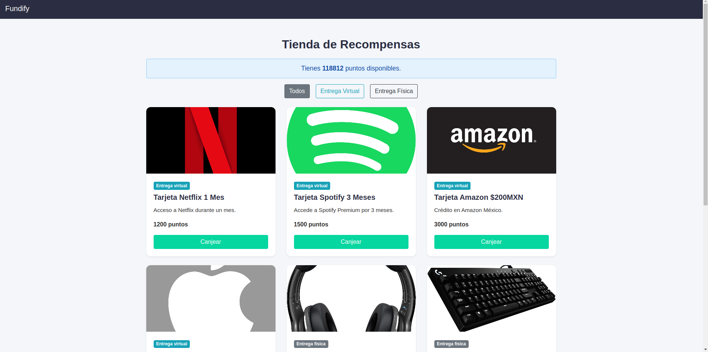

## Canjeo de una recompensa virtual

## Código de recompensa

## Canjeo de una recompensa física

## Registro de fundación
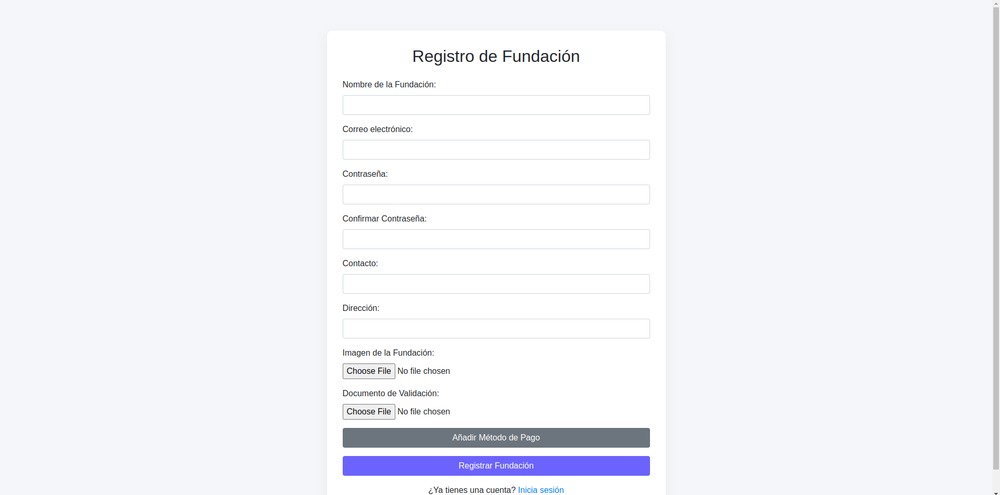

## Dashboard de fundación
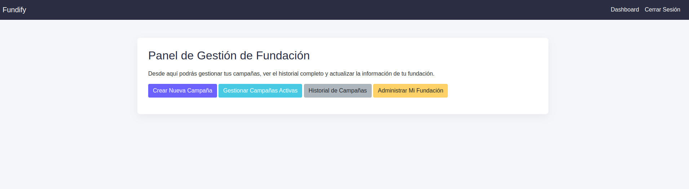

## Imposibilidad de crear campaña por falta de aprobación

## Pantalla de creación de campaña
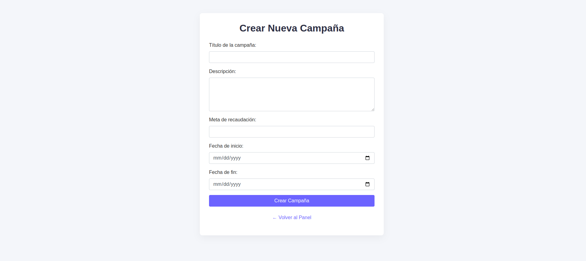

## Gestionar campaña
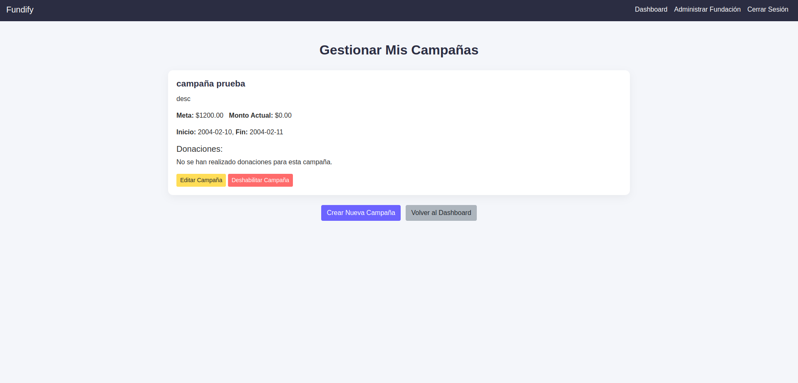

## Editar campaña
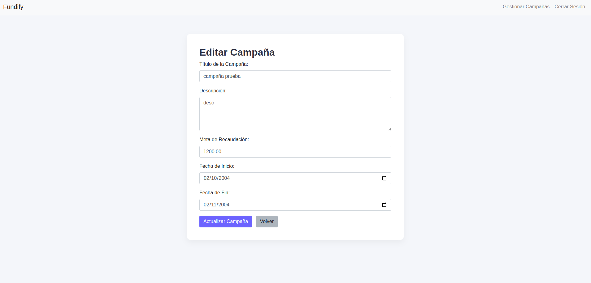

## Administrar fundación
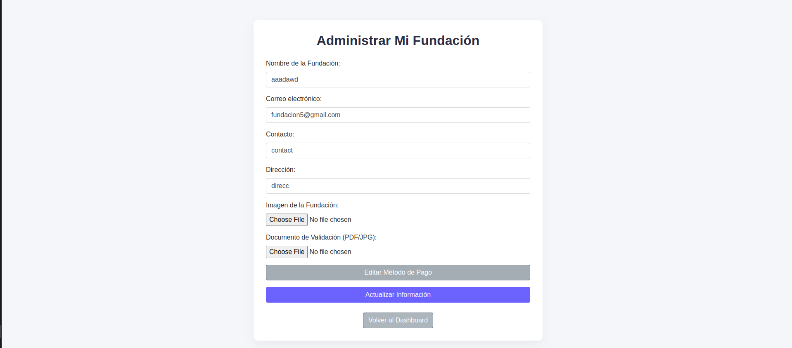

## Dashboard de administrador
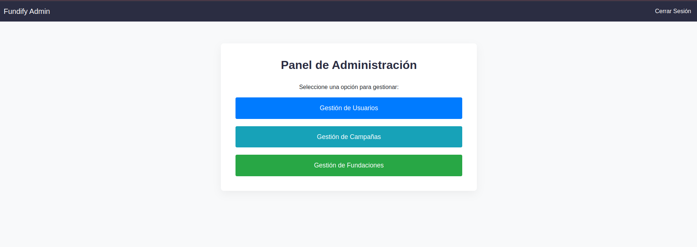

## Gestión de usuarios
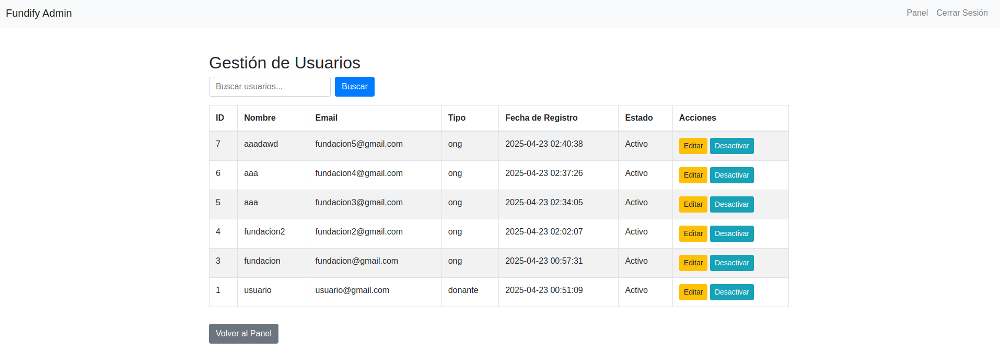

## Gestión de campañas
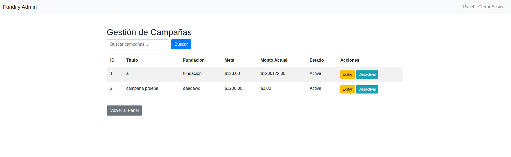

## Gestión de fundaciones
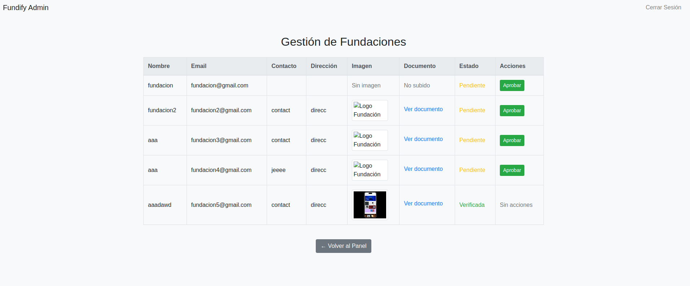